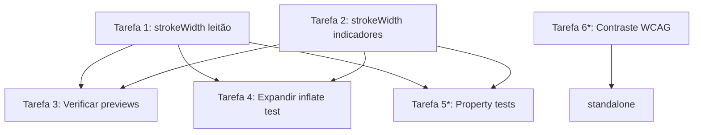

# Plano de Implementação — Identidade Visual do SuinoGestor

**Status:** Concluído (tarefas obrigatórias)
**Spec:** [requirements.md](requirements.md) · [design.md](design.md)

## Visão Geral

A maior parte da implementação já existe. As tarefas a seguir cobrem os ajustes de
conformidade pendentes, a verificação de completude dos artefatos existentes e os
testes opcionais que aumentam confiança em manutenção futura.

Tarefas marcadas com `*` são opcionais e podem ser puladas para entregar mais rápido.

---

## Tarefas

### Tarefa 1 — Normalizar strokeWidth em `ic_sg_leitao.xml`
**Status:** ✅ Concluída

**Descrição:** O rabo do leitão usa `strokeWidth="1.2"` em vez do padrão canônico 1.5,
quebrando a uniformidade visual do Icon_System.

**Arquivos:**
- `app/src/main/res/drawable/ic_sg_leitao.xml` — alterar `strokeWidth="1.2"` para
  `strokeWidth="1.5"` no path do rabo (curly tail, stroke-only)

**Critérios de Aceitação:**
- [ ] `strokeWidth` do rabo é `1.5` no XML
- [ ] Nenhum outro atributo do arquivo foi alterado
- [ ] Inflate do drawable continua sem exceção

**Dependências:** Nenhuma
**Complexidade:** Baixa
**Requisitos:** 1.2, 1.6

---

### Tarefa 2 — Normalizar strokeWidth em `ic_sg_indicadores_outlined.xml`
**Status:** ✅ Concluída

**Descrição:** As barras do gráfico e contornos do suíno usam `strokeWidth="1.2"`, em
vez do padrão 1.5. Deve ser ajustado para coesão com os demais ícones outlined.

**Arquivos:**
- `app/src/main/res/drawable/ic_sg_indicadores_outlined.xml` — alterar todos os
  `strokeWidth="1.2"` para `strokeWidth="1.5"`

**Critérios de Aceitação:**
- [ ] Todos os atributos `strokeWidth` no arquivo são `1.5`
- [ ] Nenhum fill color hardcoded foi introduzido
- [ ] Inflate do drawable continua sem exceção

**Dependências:** Nenhuma
**Complexidade:** Baixa
**Requisitos:** 1.2, 1.6

---

### Tarefa 3 — Verificar completude do `SuinoGestorIconsPreview.kt`
**Status:** ✅ Concluída — arquivo já cobria todos os 16 ícones do catálogo tipado

**Descrição:** O arquivo existe, mas deve cobrir todos os 18 ícones do Icon_System,
incluindo os tamanhos 24dp e 48dp e ambos os temas (claro/escuro) por categoria.

**Arquivos:**
- `app/src/main/java/br/com/suinogestor/ui/theme/SuinoGestorIconsPreview.kt` —
  confirmar e complementar se necessário

**Conteúdo esperado:**
```kotlin
// 3 grupos de @Preview, cada um com variantes claro + escuro:
// 1. AnimaisIconsPreview       → Matriz, Reprodutor, Leitao (24dp e 48dp)
// 2. FasesReprodutivasPreview  → Cobertura, Gestacao, Parto, Lactacao, Desmame (24dp e 48dp)
// 3. ModulosIconsPreview       → 4 pares Outlined/Filled (24dp)
```

**Critérios de Aceitação:**
- [ ] Todos os 18 ícones aparecem em pelo menos um @Preview
- [ ] Cada grupo tem variante `uiMode = UI_MODE_NIGHT_NO` e `UI_MODE_NIGHT_YES`
- [ ] Ícones exibidos em tamanhos 24dp e 48dp
- [ ] Arquivo compila sem warnings

**Dependências:** Tarefa 1, Tarefa 2 (strokeWidth correto antes de revisar previews)
**Complexidade:** Baixa
**Requisitos:** 7.5, 7.6

---

### Tarefa 4 — Expandir `IconInflateTest.kt` para cobrir todos os 18 drawables
**Status:** ✅ Concluída — adicionado `splashAnimadoInflaSemExcecao()` via `ContextCompat.getDrawable()`

**Descrição:** O teste atual valida 16 drawables (exclui `ic_sg_splash_static` e
`ic_sg_splash_animated`). Deve incluir os 2 restantes para cobertura completa.

**Arquivos:**
- `app/src/androidTest/java/br/com/suinogestor/IconInflateTest.kt` — adicionar
  `R.drawable.ic_sg_splash_static` e `R.drawable.ic_sg_splash_animated` à lista de
  drawables testados

**Critérios de Aceitação:**
- [ ] Lista de drawables no teste contém todos os 18 `ic_sg_*`
- [ ] Todos os 18 drawables inflatam sem exceção
- [ ] Teste passa no emulador/dispositivo

**Dependências:** Tarefa 1, Tarefa 2
**Complexidade:** Baixa
**Requisitos:** 6.10 (via design.md — inflate sem exceção)

---

### Tarefa 5* — Testes de propriedade: viewport e ausência de hardcode
**Status:** Opcional

**Descrição:** Testes unitários (JVM, sem emulador) que parsam os XMLs dos drawables
e verificam propriedades estruturais, prevenindo regressões em novos ícones.

**Arquivos:**
- `app/src/test/java/br/com/suinogestor/IconSystemPropertyTest.kt` — criar

**Propriedades a testar:**
```
Propriedade A: viewportWidth=24 e viewportHeight=24 em todos ic_sg_* (exceto launcher)
Propriedade B: ausência de padrão /#[0-9A-Fa-f]{6}/ em fillColor/strokeColor nos
               ic_sg_* de UI (exceto ic_sg_splash_static e ic_launcher_foreground)
Propriedade C: existência dos pares ic_sg_<modulo>_outlined.xml e
               ic_sg_<modulo>_filled.xml para os 4 módulos
```

**Critérios de Aceitação:**
- [ ] `IconSystemPropertyTest.kt` criado em `src/test/`
- [ ] 3 propriedades verificadas sem dependência de emulador
- [ ] Testes passam com `./gradlew testDebugUnitTest`

**Dependências:** Tarefa 1, Tarefa 2
**Complexidade:** Média
**Requisitos:** 1.3, 1.4, 6.2

---

### Tarefa 6* — Teste de contraste WCAG para pares de cor do Icon_System
**Status:** Opcional

**Descrição:** Teste unitário que verifica contraste ≥ 4,5:1 nos pares de cor usados
com ícones, usando a fórmula de luminância relativa WCAG 2.1.

**Arquivos:**
- `app/src/test/java/br/com/suinogestor/IconContrastTest.kt` — criar

**Pares a verificar:**
```
· onSecondaryContainer (#FFFFFF equiv.) sobre secondaryContainer (#8B6914 equiv.)
· onSurfaceVariant sobre Surface (light + dark scheme)
· #FFFFFF sobre #5D7A3E (launcher foreground / splash)
```

**Critérios de Aceitação:**
- [ ] `IconContrastTest.kt` criado em `src/test/`
- [ ] Função `contrastRatio(foreground, background): Double` implementada
- [ ] Todos os pares retornam contraste ≥ 4,5
- [ ] Testes passam com `./gradlew testDebugUnitTest`

**Dependências:** Nenhuma
**Complexidade:** Média
**Requisitos:** 8.1

---

## Dependências entre Tarefas



---

## Checklist Final

Após todas as tarefas:
- [ ] `./gradlew assembleDebug` sem erros
- [ ] `./gradlew lintDebug` sem warnings nos arquivos do Icon_System
- [ ] `./gradlew testDebugUnitTest` passa (inclui Tarefas 5* e 6* se implementadas)
- [ ] `./gradlew connectedDebugAndroidTest` passa (Tarefa 4 — requer dispositivo)
- [ ] Todos os ícones renderizam no Android Studio via SuinoGestorIconsPreview.kt
- [ ] design-system.md seção "Ícones Customizados" está atualizada e consistente com
  os arquivos implementados
- [ ] Revisão visual manual: 18 ícones reconhecíveis em 24dp; leitão/reprodutor/matriz
  distinguíveis entre si; narrativa do ciclo reprodutivo legível em sequência
